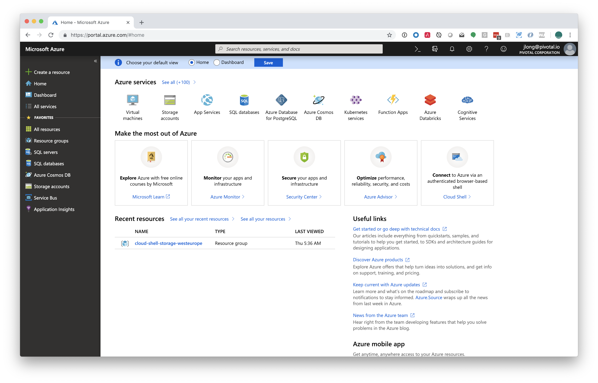
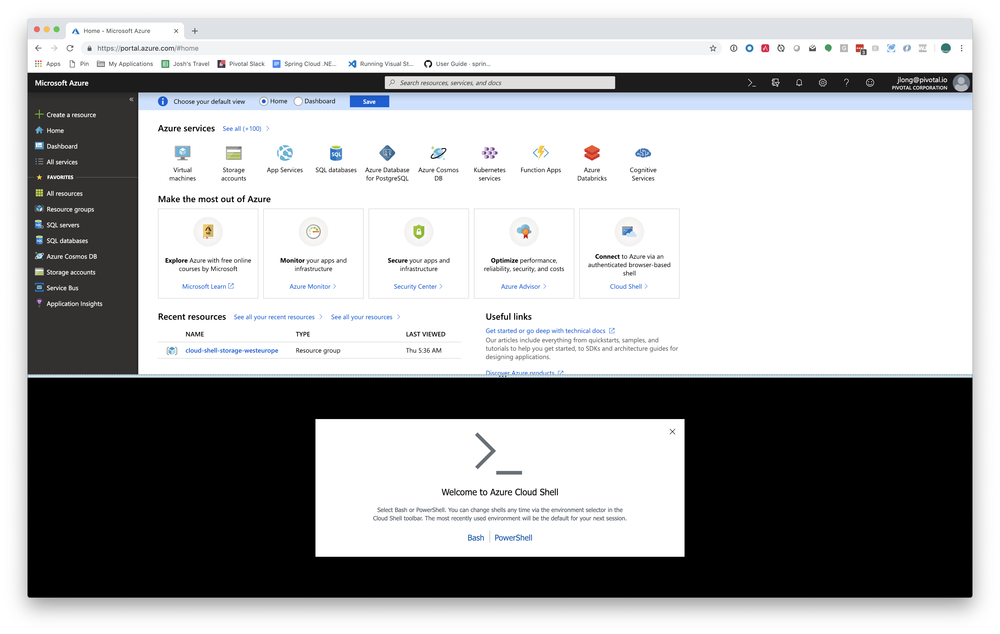

# Bootiful Azure

* Bootiful Azure: Taking Your First Steps with Microsoft Azure
* Bootiful Azure: SQL-based data access with Microsoft SQL Server (bonus! it supports reactive programming)
* Bootiful Azure: Global Data Access with CosmosDB
* Bootiful Azure: Azure Service Bus
* Bootiful Azure: Object Storage Service
* Bootiful Azure: To Production
** Azure Application Insights
** Using the Azure Services in a Cloud Foundry Environment

:sma: Spring for Microsoft Azure
:msa: Microsoft Azure
:gcp: Google Cloud Platform

# Bootiful Azure: Taking Your First Steps with Microsoft Azure

In this installment we're going to introduce the Spring for Microsoft Azure support, focusing on the interesting technologies that are enabled by the platform for consumption from Spring applications. I want to stress as I always do that you should leverage Microsoft Azure where it provides a differentiated experience. *Microsoft Azure* and *Google Cloud* and *Amazon Web Services* and *Alicloud* all offer infrastructure services like custom message queues, storage, databases, etc., that provide compelling and sometimes superior alternatives to more stock standard commodity and open source alternatives. All platforms have things that set them ahead of the herd in one way or another. These things necessarily have _gravity_; where anyone can run a MySQL  or Redis, very few can run a Google Cloud Spanner or a Microsoft CosmosDB. Use the righ tool for the  job! Use CosmosDB if it is the solution you need.

If the work you're trying to do is generic enough that it is untethered to a particular platform then you should absolutely work to consume it in as untethered a way as possible. Stay generic, whenever possible. Want to run a Java or Node.js process? Use a container orchestrator like Kubernetes. Or, if you like yourself, and you like getting to production quickly, use a platform-as-a-service like Heroku or Cloud Foundry whose currency are applications, not low-level containers. These technologies let you think in terms of the application binary and deliver to production quickly. They're also both open-source and have huge use bases and ecosystems, so they are the easiest solution _and_ the most powerful one. Using the generic tool is also the best choice, in this case, technically. It's dead simple to get started with tools like Cloud Foundry (just install and deploy the Pivotal Cloud Foundry service on Microsoft Azure) or Kubernetes on Microsoft Azure.

Databases are a particularly sticky proposition. If you invest in a proprietary database like Google's Spanner, you should expect that it'll be _very_ hard to move the data off of that platform if you should ever want to do that one day. Dave McCrory, former Riak CTO, talks about the idea of _data gravity_ - this notion that data pools inspire ecosystems of applications that feed into, and draw from, that pool. The more useful those applications the more people use them, and the more likely people are to the build on those integrations. Salesforce is a great example of this. Its data is _sticky_. Salesforce, the CRM, is rich and extensive, but it's by no means the only full-featured CRM. What it does have, more than any competitive offering, is an ecosystem of partner integrations on which people have since become dependent. Those partner integrations make Salesforce a Hotel California-style proposition: you can checkin but you can never leave. So, clearly, use the best tool for the job but realize that, beyond having a considerable administration markup, these tools have an optionality cost, too.

## Setup

Let's take a look at Microsoft Azure itself. You'll need to login to the portal to obtain the relevant configuration keys for the various services we'll introduce in the course of this series. The portal is [something you should bookmark](http://portal.azure.com). Usually, when you look at  the relevant section of the portal for the services you're using, you'll see a section called "Keys" or "Configuration Keys," or something like that. It is unfortunately not 100% consistent across the services.



In this series we'll focus on leveraging the platform's strengths - the things where Microsoft offer differentiating advantages through their Azure platform. You can achieve most of what we're going to introduce in this article using the `az` command-line tool. It's easy enough to install on multiple operating systems since it's written in Python. Consult [this the documentation for more information](https://docs.microsoft.com/en-us/cli/azure/install-azure-cli?view=azure-cli-latest) on how to install the Microsoft Azure CLI, `az`.

That's about it. Assuming you have an Azure account and the `az` CLI ready to use, you're ready to start coding. Azure doesn't have a platform-wide notion of authentication. You authenticate per-service. This makes working with each individual service straightforward, but it means that - holistically - you worry about authentication more often upfront then you do when using, for example, Google Cloud. This isn't to say that one introduces more work. With Google Cloud you have to often and explicitly "opt-in" to a particular service before you can use it. So: six of one, a half dozen of the other, I suppose.

You start new projects using Spring Boot, as you might  expect, with [the Spring Initializr](http://start.Spring.io). Select `Azure Support` in addition to whatever else you want to use. Alternatively, if you want to introduce the Microsoft Azure dependencies to an existing application you can add a Maven bill-of-materials (BOM) artifact to your Spring Boot project's Maven or Gradle build manually. Here's how you'd do it for Maven.

```xml
    <dependencyManagement>
        <dependencies>
            <dependency>
                <groupId>com.microsoft.azure</groupId>
                <artifactId>azure-spring-boot-bom</artifactId>
                <version>${azure.version}</version>
                <type>pom</type>
                <scope>import</scope>
            </dependency>
        </dependencies>
    </dependencyManagement>
```

In my case, the Maven property `azure.version`, was set to `2.0.5`.

From here onward, I'll introduce Maven-repository dependency coordinates using the Ivy syntax: `groupId` : `artifactId` : `version`. Sometimes, the `version` isn't required so I'll omit it since the BOM will manage those versions for us.

## Authentication 

If you want to follow along with these examples  using the  `az` CLI installed on your local machine, you'll need to run `az login`. Otherwise you  can launch the Microsoft Azure Cloud Shell from within  the Azure portal. It'll give you two choices: Bash or Powershell. 



## Resource Groups 

Once you're logged in you'll need to configure a resource group. A resource group is a named collection of resources. This is a convenient thing to have around because you can standup all the resources related to this introduction to Spring and Microsoft Azure, associating each with this resource group, and then, when you're all done, destroy the resource group and it'll cascade delete everything associated with it. 

This makes billing, lifecycle administration and so much more very convenient! Each resource group is associated with a region. Microsoft Azure have tons of regions on which you can run your services. As of this writing, [there are 54 regions worldwide](https://azure.microsoft.com/en-us/global-infrastructure/regions/), more than any other cloud provider. 

Here's how you would create a resource group called `bootiful` in the `West US 2` location of the US.  We'll use this in subsequent examples. 

```shell
az group create --name bootiful --location "West US 2"
```

You can run the following command to iterate all the possible locations: `az account list-locations`. You'll notice that as we issue commands we need to associate resources with a particular location on creation, usually with `-l` or `--location`. This can be tedious, so it's helpful to specify a default location and then omit it on subsequent invocations, like this: `az configure --defaults location=westus`.

Confirm that everything is working by running `az configure`. 

## The Cloud Foundry Service Broker

There's [a Cloud Foundry service broker](https://pivotal.io/platform/services-marketplace/data-management/microsoft-azure) that you can use to quickly spin up various Microsoft Azure services and then bind them to your application. This service broker makes running applications on Cloud Foundry, especially on top of Microsoft Azure, the easiest path to production for applications targeting Microsoft Azure services.

There ya go! You now know everything you need to know to setup a Spring application to leverage services on Microsoft Azure.

# Bootiful Azure: SQL-based data access with Microsoft SQL Server  

Let's start with something short and sweet, the legendary Microsoft SQL Server. Microsoft SQL Server is an interesting beast. Sure, you can run it yourself, but wouldn't you rather Microsoft, who build the product itself, do that for you? Now _that_ is a full-service solution! Imagine how nice that is? You don't often see that sort of solution in other contexts. Imagine buying a car that you can drive as fast as you'd like, and on which the the manufacturer will guarantee any and all maintenance and repairs? Forever? Even if the car is hit with an asteroid? This is why running Microsoft SQL Server on Microsoft Azure is so appealing: the drudgery of the ownership is removed.

Don't get me wrong. There's plenty to recommend SQL Server in its own right. SQL Server has been around since 1989! It's routinely ranked up there with the likes of Oracle DB and PostgreSQL as being among the most feature-filled database options out there. It's been built over decades to serve enterprise use cases. It's even got things that other databases, including the venerable PostgreSQL, sometimes lack, like Transparent Data Encryption wherein data is transparenly encrypted at rest.

SQL Server has its origins as an enterprise-grade database that ran on one operating system.... OS/2! Wait, OS/2? Surely you meant Microsoft Windows? Nope! Microsoft joined Ashton-Tate and Sybase in the late 1980s to create a variant of Sybase SQL Server for IBM OS/2 (developed jointly with Microsoft at the time), which was released the following year.

This was the first version of Microsoft SQL Server, and served as Microsoft's entry to the enterprise-level database market, competing against Oracle, IBM, and later, Sybase. SQL Server 6.0 was the first version designed for NT without direction from Sybase.

Windows NT was released in July 1993 and Sybase and Microsoft took differing directions. Each pursued its own design and marketing schemes. Microsoft negotiated exclusive rights to all versions of SQL Server written for Microsoft operating systems. Sybase and Microsoft SQL Server are two very different things today, with radically different codebases. Now, Microsoft maintain several editions of SQL Server for different usecases and workloads. It's hard to qualify why Microsoft SQL Server is so amazing, so I'll instead refer you to this [pretty exhaustive Wikipedia page demonstrating](https://en.wikipedia.org/wiki/Comparison_of_relational_database_management_systems) different features acrosss various SQL database engines. Microsoft SQL Server fares pretty well!

## Configuring SQL Server on Microsoft Azure

So, it was my hope to show you how to follow these instructions in the user interface in terms of screenshots but that seemed less than ideal because things in the Azure portal tend to be... squirmy. Things move around. Also, these things are infinitely less scriptable. So, we're going to use the `az` CLI. Trouble is, it's ... tedious. 

Logically, what we want to do is trivial. We want to:

* create a SQL Server server instance 
* create a SQL Server database in the server. Our Spring Boot application will preload this with a sample schema and data.
* expose the SQL Server instance to client accesses from our computer

We're going to use a script to do this work:

```shell
#!/bin/bash

# Set an admin login and password for your database
export adminlogin=bootiful
export password=B00t1ful

# The logical server name has to be unique in the system
export servername=${1}-server

# The ip address range that you want to allow to access your DB
export startip=0.0.0.0
export endip=223.255.255.255

# the name of the resource group
export rg=$1

# Create a logical server in the resource group
az sql server create \
    --name $servername \
    --resource-group $rg \
    --admin-user $adminlogin \
    --admin-password $password

# Configure a firewall rule for the server
az sql server firewall-rule create \
    --resource-group $rg \
    --server $servername \
    -n AllowYourIp \
    --start-ip-address $startip \
    --end-ip-address $endip

# Create a database in the server with zone redundancy as true
az sql db create \
    --resource-group $rg \
    --server $servername \
    --name ${1}-sample-db \
    --service-objective Basic
```

This should dump out a _wall_ of JSON! Yikes! I culled this example from the Azure documentation and thank goodness, too! I don't think I would want to have to arrive at this solution by myself. You're going to want to note the `name` attribute in the first JSON stanza printed to the console. We used the `$RANDOM` variable to generate a, well, _random_ name, so it'll be different on your machine. On my machine the value was `bootiful-22952`. 

Now, you've got a working server and a working database within the server. If you poke around the Azure Portal you'll gleam all the connection information required to connect to the database. _Or_, you could use this _one simple trick_.  

```shell
az sql db show-connection-string --client jdbc --name bootiful-sample-db
```

This command gives you client connection strings for a number of technologies, including the Windows ADO subsystem, Java's JDBC driver interface, and PHP's PDO interface. You'll need to replace the `<server>`, `<username>` and `<password>` section of the URI with the appropriate values, in this case `bootiful-server`, `bootiful` and `B00t1ful` respectively. Alternatively, as we'll see in a moment, you can define properties and use property placeholder resolution to parameterize this part of the connection string.

## Introducing SQL Server into your Spring Application

Now that we've got a freshly confiugured SQL Server instrance up and running we need only use it like we would any other JDBC dependency in our codde. If you're using the Spring Initialzir you can select `SQL Server` and the appropriate dependency will be added to your Maven or Gradle build. Or, you can add it manually to your build using the following coordinates: `com.microsoft.sqlserver` : `mssql-jdbc`. You don't need to specify the version; that's done for you by Spring Boot itself. This particular dependency and itnegration with Microosft technologies doesn't even require  a particular Maven bill-of-materials dependency - it just works.

Then, you'll need to specify the usual confiuguration properites so that Spring can instnantiate a connection to the `DataSource` for you.

```properties;

sql-db=bootiful-sample-db
sql-username=bootiful
sql-password=B00t1ful
sql-servername=bootiful-server

spring.datasource.url=jdbc:sqlserver://${sql-servername}.database.windows.net:1433;database=${sql-db};user=${sql-username}@${sql-servername};password=${sql-password};encrypt=true;trustServerCertificate=false;hostNameInCertificate=*.database.windows.net;loginTimeout=30
spring.datasource.username=${sql-username}
spring.datasource.password=${sql-password}

spring.datasource.initialization-mode=always

```

I've encoded the username and password here, in the property file. This is a **bad** idea. Generally, this is exactly the sort of thing you will want to live in an environment variable or in a configuration service like Spring Cloud Config Server. That setup out of the way, it's trivial to use the resulting connection with any technology that supports both JDBC, generally, and Microsoft SQL Server, specifically.

Our application will consume data that needs to be installed in the database beforehand. Spring can help us out here. Spring Boot can automatically execute `src/main/resources/schema.sql` and `src/main/resources/data.sql` against the configured `DataSource` if you specify `spring.datasource.initialization-mode=always` in your properties. `schema.sql` is an ideal place  in which to put database DDL, and `data.sql` is an ideal place in which to put sample data.

Here is `src/main/resources/schema.sql`.

```sql 
drop table customer; 
create table customer
(
  id         INT          NOT NULL IDENTITY PRIMARY KEY,
  first_name varchar(255) not null,
  last_name  varchar(255) not null
);
```

Here is our `src/main/resources/data.sql`.

```sql
insert into customer(first_name, last_name)
values ('james', 'watters'),
       ('bob', 'lee'),
       ('trisha', 'gee'),
       ('mario', 'gray'),
       ('spencer', 'gibb'),
       ('yitao', 'dong');
```

Both will have been executed before our various event listeners. Let's look at an event listener that pulls that data back out using a `JdbcTemplate`. 

```java
package com.example.bootifulazure;

import lombok.AllArgsConstructor;
import lombok.Data;
import lombok.NoArgsConstructor;
import lombok.extern.log4j.Log4j2;
import org.springframework.boot.context.event.ApplicationReadyEvent;
import org.springframework.context.event.EventListener;
import org.springframework.jdbc.core.JdbcTemplate;
import org.springframework.jdbc.core.RowMapper;
import org.springframework.stereotype.Component;

import java.util.List;

@Component
@Log4j2
class SqlServerDemo {

        private final JdbcTemplate jdbcTemplate;

        SqlServerDemo(JdbcTemplate jdbcTemplate) {
                this.jdbcTemplate = jdbcTemplate;
        }

        @EventListener(ApplicationReadyEvent.class)
        public void demo() {
                String query = " select TOP 3 * from customer ";
                RowMapper<Customer> rowMapper =
                    (rs, rowNum) -> new Customer(rs.getLong("id"), rs.getString("first_name"), rs.getString("last_name"));
                List<Customer> customerList = this.jdbcTemplate.query(query, rowMapper);
                customerList.forEach(log::info);
        }

        @Data
        @AllArgsConstructor
        @NoArgsConstructor
        private static class Customer {
                private Long id;
                private String firstName, lastName;
        }
}
```

SQL Server is a compelling database for a number of use cases and the fact that Microsoft Azure makes scaling it so easy is a win for everyone. It's worth mentioning that R2DBC, an effort at reactive SQL datastore access, already offers a Microsoft SQL Server implementation, in addition to H2 and PostgreSQL. You can even do reactive SQL Server access for even faster applications. All, seemingly, at the push of a button (or at least a tedious deployment script).

# Bootiful Azure: Global Scale Data Access with CosmosDB

I can hear you thinking - yes, not even your feintest thoughts escape me! - that while you like Microsoft SQL Server as much as the next developer, it's certainly something you could've run yourself, on any platform (cloud or otherwise!). You don't _need_ Microsoft to run it for you. To which I say, "yep!" (But it sure is nice that Microosft runs it for us, though, isn't it?)

I concede the point. What can Azure do for you? You don't need to look much further than Microsoft Azure CosmosDB. CosmosDB refers to a suite of technologies. It describes a single product that can be used in mutliple ways. It's a single, multi-model, multi-modal database that supports  document data, SQL queries, graph data access, and more.

Per [the product web page](https://azure.microsoft.com/en-us/services/cosmos-db/): CosmosDB was built from the ground up iwth global didstibution and h9orizontal scale at its core. guarantees single-digit-millisecond read and write latencies at the 99th percentile, and guarantees 99.999 high availability with multi-homing anywhere in the world—all backed by industry-leading, comprehensive service level agreements (SLAs).

## Items and Containers

Internally, CosmosDB stores "items" in "containers." But you don't necessarily deal with items or containers as the concepts will surfaced in the language oft he data model you're using to consume the data. If you're using it as a document store, like MongoDB, then items would be mapped to documents in collections, for example.

Containers are grouped into databases, which are a sort of namespace above containers. Containers enforce unique key constraints to ensure integrity of the data. But containers do so much more. You can ask each container for a feed of what's changed; you could power Change Data Capture (CDC) schemes using this feed.  You could use the feed for eventsourcing. The feed is itself persisted so you can _replay_ changes, if you like.

You can specify time-to-live (TTL) values for the containers, as well, letting CosmosDB automatically expunge existing records after a certain period. You could also override the TTL for speciifc items, too.  

## A Mutli-Model, Multi-Paradigm Datastore

First of all, CosmosDB is schemaless. Keep that mind when using it - it can have some important ramifications if you're not prepared.  

CosmosDB supports a multi-model, multi-paradigm approach to building applications. Clients can talk to the HTTP REST API and drive it using a SQL-like language for queries. You can create, update and delete containers using the SQL API, too.

You can talk to CosmosDB using the MongDB API, supporting collections as contrainer and documents as items.

You can talk to it using the Gremlin API supporting graphis and containers and nodes and edges as items. According to the Gremlin website, "Gremlin is the graph traversal language of Apache TinkerPop. Gremlin is a functional, data-flow language that enables users to succinctly express complex traversals on (or queries of) their application's property graph." So, it's basically a way to traverse data in a graph.

You can talk to CosmosDB using the Cassandra API supporting tables as containers and rows as items. The Cassandra API even supports the Cassandra query language (CQL).

You can _also_ talk to it using the AZure Table Storage API supporting tables as containers and items as... well.. _items_.

CosmosDB also embeds a JavaScript engine so you can use JavaScript to define triggers, user-defined functions that can be called from, and augment, the SQL query language, and stored procedures. Stored procedures can manage a number of actions in a single ACID-compliant transaction.  

## Configuring CosmosDB on Microsoft Azure

You'll need to first create a (potentially geographically distributed) instance of CosmosDB and then create a database instance within. Then, you'll need to create a collection to store the records. Here's a script. The only notable thing is that we don't have to specify the firewall exemptions as we did in the SQL Server example. It just works (TM).

```shell
#!/bin/bash

# the name of the resource group
export rg=$1
export adminlogin=${rg}-cosmosdb

location='southcentralus'
accountname=${adminlogin}
databasename=bootiful
containername=reservations

# Create a SQL API Cosmos DB account with session consistency and multi-master enabled
az cosmosdb create \
    --resource-group $rg \
    --name $adminlogin \
    --kind GlobalDocumentDB \
    --default-consistency-level "Session" 

# Create a database
az cosmosdb database create \
    --resource-group $rg \
    --name $adminlogin \
    --db-name $databasename

# Create a SQL API container with a partition key and 1000 RU/s
az cosmosdb collection create \
    --resource-group $rg \
    --collection-name $containername \
    --name $adminlogin \
    --db-name $databasename \
    --partition-key-path /id \
    --throughput 1000
```

In this script we could've specified the regions in which want the new database made available. You can also do this conveniently from the Azure Portal, through a handy map. Just click a region and it'll take care of the rest! 

Also, note the resulting `$adminlogin` value for later. 

Now, you'll need to lay hands on the required configuration strings to connect your application to your new database and its data. You could sift through the output of the previous commands, but the following incantation is so much easier.

```shell
az cosmosdb list-keys --resource-group bootiful --name bootiful-cosmosdb
```

You'll need to note the value of the resulting `primaryMasterKey` attribute from the previous command in order to later connect to CosmosDB. 

## Introducing CosmosDB into your Spring Application

Let's look at CosmosDB's use in a Spring application. You _could_, in theory, talk to CosmosDB through the appropriate abstractions for the aforementioned technologies (like MongoDB and Cassandra). I prefer to use the Spring Data CosmosDB abstraction, whose starter dependency you'll need to add to the build file. 

CosmosDB was historically called DocumentDB. If you see those names, they are almost interchangeable. For historical reasons, you'll need to add the Maven starter dependency that references that old project name,  `com.microsoft.azure`:`azure-documentdb-spring-boot-starter`, to your build file.

Then you'll have to configure the relevant connection information. You could add something like the following to your application's `application.properties` file.

```java
azure.documentdb.database=bootiful
azure.documentdb.key=THIS_IS_THE_KEY_FROM_BEFORE
azure.documentdb.uri=https://ADMINLOGIN.documents.azure.com:443/
```

The `database` property refers to the database (`bootiful`, because we used the resource group name as the database name) within the logical CosmosDB instance (`bootiful-cosmosdb`, which is what we specified with `$adminlogin` in our script).  The key refers to the `primaryMasterKey` value from the `az cosmosdb list-keys` command. Replace the property values with the relevant and appropriate string values.

I ran this project just fine on a macOS based system, but I hit an odd issue when running it on my Ubuntu 18.10-based system. There's an oddity in the way that the Spring client libraries for CosmosDB gather telemetry that results in a NPE. If you encounter this, add the following to `src/main/resources/application.properties` to disable the telemetry.

```properties
cosmosdb.telemetryAllowed=false 
```

Next, you should define a Spring Data entity to map to the records in the CosmosDB collection, `reservations`.  

```java
package com.example.bootifulazure;

import com.microsoft.azure.spring.data.cosmosdb.core.mapping.Document;
import com.microsoft.azure.spring.data.cosmosdb.core.mapping.PartitionKey;
import lombok.AllArgsConstructor;
import lombok.Data;
import lombok.NoArgsConstructor;

@Data
@AllArgsConstructor
@NoArgsConstructor
@Document(collection = "reservations")
class Reservation {

        @PartitionKey
        private String id;
        private String name;
}
```

Mostly, this looks like any other Lombok-annotated POJO you've ever seen. Of particular note is that the entity uses `@Document` from the Spring Data CosmosDB module to specify the `reservations` collection to which this entity maps. The entity uses a CosmosDB-specific annotation, `@PartitionKey`, to signal to the database which field to use when deciding to partition (logically or physically) possibly related data in a container. It's good practice to use a `String` for the partition key. Monotonically incrementing primary keys aren't a great idea in planet-scale distributed systems! 

Now, define the Spring Data repository building on the `DocumentDbRepository`.

```java  
package com.example.bootifulazure;

import com.microsoft.azure.spring.data.cosmosdb.repository.DocumentDbRepository;

interface ReservationRepository extends DocumentDbRepository<Reservation, String> {
}
```

The `DocumentDbRepository` might be new, but this should be otherwise straightforward.

```java
package com.example.bootifulazure;

import lombok.extern.log4j.Log4j2;
import org.springframework.boot.context.event.ApplicationReadyEvent;
import org.springframework.context.event.EventListener;
import org.springframework.stereotype.Component;

import java.util.UUID;
import java.util.stream.Stream;

@Log4j2
@Component
class CosmosDbDemo {

    private final ReservationRepository rr;

    CosmosDbDemo(ReservationRepository rr) {
        this.rr = rr;
    }

    @EventListener(ApplicationReadyEvent.class)
    public void demo() throws Exception {

        this.rr.deleteAll();

        Stream.of("A", "B", "C")
            .map(name -> new Reservation(UUID.randomUUID().toString(), name))
            .map(this.rr::save)
            .forEach(log::info);

    }
}
```

# Bootiful Azure: Integration with Azure Service Bus

Azure Service Bus is a cloud messaging as a service and integration technology. It is, just like CosmosDB, as flexible as possible. It [supports the AMQP 1.0 protocol](https://docs.microsoft.com/en-us/azure/service-bus-messaging/service-bus-java-how-to-use-jms-api-amqp), like RabbitMQ. AMQP is a flexible wire protocol. The protocol itself includes instructions for administering the broker, beyond just interacting with it. AMQP brokers are ideal for integration because they are language- and platform-agnostic. In an AMQP broker producers send messages to _exchanges_ which then route the messages to _queues_, from which consumers then read the messages. The exchange is responsible for deciding to which queue the message should be sent. It does this in any of a number of ways but it usually involves looking at a key in the message headers called the _routing key_.

This indirection between the exhcange and the queues makes AMQP a bit more flexible than JMS-based brokers where producers send messages directly to `Destination` objects  that consumers then read from. This means that producers and consumers are coupled by their choice of `Destination`. Additionally, JMS is an API for the JVM, it is not a wire protocol. As such, producers and consumers are dependent on the version of the library they're using being correct. That said, [you can also use Azure Service Bus through the JMS API](https://docs.microsoft.com/en-us/azure/service-bus-messaging/service-bus-java-how-to-use-jms-api-amqp).

Like I said, Azure Service Bus is nothing if not flexible!

The AMQP model is illustrative because, basically, the native model for Azure Service Bus looks like AMQP. In Azure Service Bus you have topics or queues to which you send messages. Messages are then connected to subscriptions, from which consumers read. Let's build a simple example that sends and then consumes messages. We won't use AMQP or JMS, just the regular Microsoft Azure ServiceBus API.


## Configuring Azure Service Bus on Microsoft Azure

You'll need to provision a servicebus namespace, a topic (top which we send messages and from which multiple consumers may listen) and a subscription (a consumer to either a topic or a queue) to connect to the topic. Here's an example script that does just that.

```shell
#!/usr/bin/env bash

destination=messages
topic=${destination}-topic
subscription=${destination}-subscription
namespace=bootiful
rg=$1

az servicebus namespace create --resource-group $rg \
    --name ${namespace}

az servicebus topic create --resource-group $rg \
    --namespace-name ${namespace} \
    --name ${topic}

az servicebus topic subscription create --resource-group $rg  \
    --namespace-name ${namespace} --topic-name ${topic} \
    --name ${subscription}
```

You'll need a connection string in order to connect your Spring application to the servicebus. Run this command and note the `primaryConnectionString` attribute value for later.

```shell
az servicebus namespace authorization-rule keys list --resource-group bootiful --namespace-name bootiful --name RootManageSharedAccessKey
```

## Introducing Azure Service Bus into your Spring Application

Add the following dependency to your build: `com.microsoft.azure` : `azure-servicebus-spring-boot-starter`.

We'll write two components: one a producer and the other a consumer. In a _real_ application these things would naturally live in separate applications and separate processes. Messaging serves to support the integration of disparate applications, after all. We'll look at the consumer first. The consumer needs to register a subscriber _before_ something else has produced the message, so we'll make these beans _ordered_ - the Spring container will order their initialization one before the other based on the `Ordered` value we give it.

```java
package com.example.bootifulazure;

import com.microsoft.azure.servicebus.ExceptionPhase;
import com.microsoft.azure.servicebus.IMessage;
import com.microsoft.azure.servicebus.IMessageHandler;
import com.microsoft.azure.servicebus.ISubscriptionClient;
import lombok.extern.log4j.Log4j2;
import org.springframework.boot.context.event.ApplicationReadyEvent;
import org.springframework.context.event.EventListener;
import org.springframework.core.Ordered;
import org.springframework.stereotype.Component;

import java.util.concurrent.CompletableFuture;

@Log4j2
@Component
class ServiceBusConsumer implements Ordered {

    private final ISubscriptionClient iSubscriptionClient;

    ServiceBusConsumer(ISubscriptionClient isc) {
        this.iSubscriptionClient = isc;
    }

    @EventListener(ApplicationReadyEvent.class)
    public void consume() throws Exception {

        this.iSubscriptionClient.registerMessageHandler(new IMessageHandler() {

            @Override
            public CompletableFuture<Void> onMessageAsync(IMessage message) {
                log.info("received message " + new String(message.getBody()) + " with body ID " + message.getMessageId());
                return CompletableFuture.completedFuture(null);
            }

            @Override
            public void notifyException(Throwable exception, ExceptionPhase phase) {
                log.error("eeks!", exception);
            }
        });

    }

    @Override
    public int getOrder() {
        return Ordered.HIGHEST_PRECEDENCE;
    }
}
```

When a message arrives, we log its `body` and `messageId` .

Now, let's look at the producer.

```java
package com.example.bootifulazure;

import com.microsoft.azure.servicebus.ITopicClient;
import com.microsoft.azure.servicebus.Message;
import lombok.extern.log4j.Log4j2;
import org.springframework.boot.context.event.ApplicationReadyEvent;
import org.springframework.context.event.EventListener;
import org.springframework.core.Ordered;
import org.springframework.stereotype.Component;

import java.time.Instant;

@Log4j2
@Component
class ServiceBusProducer implements Ordered {

    private final ITopicClient iTopicClient;

    ServiceBusProducer(ITopicClient iTopicClient) {
        this.iTopicClient = iTopicClient;
    }

    @EventListener(ApplicationReadyEvent.class)
    public void produce() throws Exception {
        this.iTopicClient.send(new Message("Hello @ " + Instant.now().toString()));
    }

    @Override
    public int getOrder() {
        return Ordered.LOWEST_PRECEDENCE;
    }
}
```

Pretty straightforward right? The meat of the classes are  in the `consume()` and `produce()` methods.  The consumer runs first, then the producer. If you've ever done any work with messaging technoogies you might find the lack of a mention of any sort of _destination_ - the topic or queue   - a bit puzzling. That configuration all lives in the properties  (such as those in your `application.properties` file) and are used when auto-configuring the `ITopicClient` and `ISubscriptionClient`. If you want to send messages or consume messages from multiple destinations, simply define the relevant beans yourself and make sure to _not_ specify `azure.service-bus.connection-string` in your application's properties, otherwise the default Spring Boot auto-configuration will kick in and try to create these beans for you.

# Bootiful Azure: Object Storage Service

Now let's turn to something a bit more... mundane. Something that you, ideally, won't even think about all that often. Applications often have storage requirements: they may need to store uploaded user content (binary data like pictures or documents), generated artifacts like PDF files, videos, music, etc. They might want to store logs. It's not hard to think of things an application might want to durably store.  

These applications _could_ use a filesystem, such as that on the local machine or a network attached filesystem like [NFS (network file system)](https://en.wikipedia.org/wiki/Network_File_System). I'll use NFS to generically refer to any network attached file system like Samba, NFS (those mounted with the NFS protocol) itself, or legacy options like DAC, FAL, etc. NFS options provide a filesystem-like interface to files, often in a hierarchical format. NFS options are interesting because they're like fileystems with which we're all familiar, and everybody knows how to work with filesystems, right? Surely, everything looks like the hierarchy expressed in Windows Explorer? Or macOS Finder? Except, they look nothing like each other...

Come to think of it, I had to say "like" when I said that NFS options are like filesystems. Some support more nuanced permissions models than others. Some support encoding and replication of metatadata attached to files and directories in the tree. Support support different speed guarantees for different operations; some filesystems may optimize for reads versus writes. Some might optimize for directory traversals. The client's perspective of a file read or write is different depending on the client used. (Is a write consistent on all replication nodes immediately?) 

Even if we assumed all the filesystems to which we wanted to write were POSIX-friendly - you could use `int open(const char *path, int flags)` or `java.io.File` - this may not be the case for our clients. What if the client doesn't "speak" filesystem, and would prefer to manipulate the data in some other way? What if the client can only speak HTTP? Or if it wanted to speak Bittorrent for more efficient consolidation of downloads through peer-to-peer networks? 

For these reasons, and more, Amazon Web Services introduced S3, the Simple Cloud Storage Service (get it? "S" times 3? "S3"?) which has since been something of a prevailing standard that all other cloud vendors need to support. For Microsoft Azure, the Object Storage Service (OSS) is the thing that provides an S3-like experience. It is not a POSIX filesystem. You can use its API directly, as we will here, but it's [also possible to use the S3Proxy to proxy writes to OSS](https://www.microsoft.com/developerblog/2016/05/22/access-azure-blob-storage-from-your-apps-using-s3-api/) using an AWS S3 client, of which there are countless! Azure's Object Storage Service truly is _boring_ which is exactly what you want when dealing with something so fundamental as persistant volumes of file-like data. It even offers a standalone browser called [the Microsoft Azure Storage Explorer](https://azure.microsoft.com/en-us/features/storage-explorer/) which runs (yep!) on Linux, Macintosh and Windows. That standalone browser lets you interrogate OSS stores _as well as_ CosmosDB data. How's that for convenient? You can of course use the `az` CLI or the API itself. We're going to use the Spring integration for the Java API. 


## Configuring Azure Object Storage Service

* you need to create a bucket and upload a file called `cat.jpg`
* you need to get the configuration values for `application.properties`


## Introducing Azure Object Storage Service into your Spring Application  

Add `com.microsoft.azure`: `azure-storage-spring-boot-starter` to your application's build file. Make sure you've specified the OSS connection string for the `azure.storage.connection-string` property.

We're going to read the bytes for an image of a cat in our application's `src/main/resources` directory and then write those bytes to the Object Storage Service as a "block blog". There are other interfaces through which you can talk to OSS, but for our purposes it's very natural to think about it as an ensemble of "containers" (logical groupings of things, almost like a directory)  and "blobs." A blob is a file, basically, with a name and metadata associated with it. So, all that the following example does is store the bytes for a cat into a container in Microsoft Azure called `files` under a random name prefixed with `cat-` and suffixed with `.jpg`. That's it!

```java
package com.example.bootifulazure;

import com.microsoft.azure.storage.CloudStorageAccount;
import com.microsoft.azure.storage.StorageException;
import com.microsoft.azure.storage.blob.CloudBlobContainer;
import com.microsoft.azure.storage.blob.CloudBlockBlob;
import lombok.extern.log4j.Log4j2;
import org.springframework.beans.factory.annotation.Value;
import org.springframework.boot.context.event.ApplicationReadyEvent;
import org.springframework.context.event.EventListener;
import org.springframework.core.io.Resource;
import org.springframework.stereotype.Component;

import java.io.InputStream;
import java.net.URISyntaxException;
import java.util.UUID;

@Log4j2
@Component
class ObjectStorageServiceDemo {

    private final CloudStorageAccount cloudStorageAccount;
    private final Resource resource;
    private final CloudBlobContainer files;

    ObjectStorageServiceDemo(
        CloudStorageAccount csa,
        @Value("classpath:/cat.jpg") Resource cat) throws URISyntaxException, StorageException {
        this.resource = cat;
        this.cloudStorageAccount = csa;
        this.files = this.cloudStorageAccount
            .createCloudBlobClient()
            .getContainerReference("files");
    }

    @EventListener(ApplicationReadyEvent.class)
    public void demo() throws Exception {
        CloudBlockBlob blockBlobReference = this.files.getBlockBlobReference("cat-" + UUID.randomUUID().toString() + ".jpg");
        try (InputStream in = this.resource.getInputStream()) {
            blockBlobReference.upload(in, this.resource.contentLength());
            log.info("uploaded blockblob to " + blockBlobReference.getStorageUri());
        }

    }
}
```

The Microsoft Azure-specific bits are less than trivial. We obtain a reference to a container and then write to it and then log out the addressable URI of the resource. It is, if nothing else, _mundane_! And that's exactly what you want in a computing system primitive like a filesystem. It should be _mundane_. To be very honest, I was more pleased with getting to use Java 7's try-with-resources syntax for the `Autocloseable` `InputStream` reference!  


# To Production!

This last post is really a quick wrapup post that looks at things to keep in mind when deploying an application built with Spring Boot and Micosoft Azure to production.

## Secure Configuration

We've developed the application with ease and aplomb from the comfort of our local machines, plugging in the relevant confuguration values as we need them. Trouble is, these are often very sensitie values tht shouldn't be left laying around on the filesystem at rest, unencrypted. There are a _number_ of good solutions for this. You could of course deploy the Spring Cloud Config Service itself. If you're running [Pivotal Cloud Foundry on Microsoft Azure (or otherwise)](https://pivotal.io/partners/microsoft), this is the recommended way because it's a one-liner to get it deployed and working. You could of course deploy [Hashicorp Vault and use Spring Cloud Vault](https://www.hashicorp.com/resources/introduction-to-using-hashicorp-vault-with-azure). Or, you could store the keys and values in Microsoft's [own Key Vault service](https://azure.microsoft.com/en-us/services/key-vault/). In order to effectively use Key Vault you'll need to get into configuring Microsoft Active Directory which, while not something I'd wish on you or your loved ones, dear reader, is something in which I'm quite interested.

## Microsoft Active Directory

In my 20+ years of helping organizations build software I've seen nary a handful that _weren't_ using Microsoft Active Directory_ even if only from the LDAP interface. I hope Google gains more traction but let's be very clear: Active Directory is _the_ prevailing standard in enterprise IT. It is a way of life, even if you and I probably don't have to worry about it all that often in our idealized world of application development. And for good reason! It integrates the entire Windows desktop experience for the business professional. It's the beating heart of the Office365 story and it's the way organization organizes and self structures itself. Want to know if you got that promotion? Check Active Directory! Want to know where someone is seated? Check Active Directory! Want to force password resets? Maintain enterprise-wide audit logs? Fire someone? Check Active Directory! You may think your organizations runs Active Directory but lets be clear: it runs your organization.

Active Directory is a directoy server. It provides a tree of users, organizations and more. It acts as  identity manager for technologies like Microsoft CRM, Microsoft SQL Server, Microsoft Office and even Microsoft Windows itself. You can describe users, their rights and roles, and so much more in Active Directory. Which brings us back around. Microsoft Azure runs Active Directory for you! You can import and configure all the relevant information for your Microsoft Active Directory install right from the platform. [There's even a Spring Boot starter to connect Microsoft Azure to your OAuth-delegating Spring Boot- and Spring Security-powered applications](https://azure.microsoft.com/en-us/blog/spring-security-azure-ad/). Could you deploy and manage something like Microsoft SQL Server or Microsoft Active Directory yourself? Sure. But, _should you_?

## Application Insights

As you scale out and spin up more microservices you'll introduce more and more moving parts and it becomes all the more critical to be able to observe the movement of data from one node to another in the system.  Here, the Microsoft Application Insights integration for Spring applications - which is for the moment at least delivered separate from the main Spring integration for Microsoft Azure - makes using it an cinch! Add `com.microsoft.azure`: `applicationinsights-spring-boot-starter` : `1.1.0-BETA`  to your build file.

You'll then need to specify an `azure.application-insights.instrumentation-key` and to give your application a  `spring.application.name` name. Which, to be fair, you should do anyway. That's it! Restart your application, drive some traffic through an HTTP endpoint and then login to the Microsoft Application Insights dashboard and watch the instrumentation in action!

// TODO obtaining the key
// TODO screenshot of APp Insights

## Cloud Foundry


You shouldn't run software that you can't charge for. Pivotal legend [James Watters](http://twitter.com/WattersJames) often talks about work that's "below the value  line," and the idea that technologists and executives should focus on work that's above that value line for a given organization. The average organization has enough problems. Running commodity software like MySQL or Kafka shouldn't be among them. It'll cost infinitely less, over enough time, to pay someone to run that, whatever _that_ is, for you if someone else can do a competent job. Ideally, whoever ends up running that software should have a vested interest in running those things well. Most organizations have a mission that's far away from configuring SSL, or debugging MySQL replication issues. It is virtually always cheaper to let someone else do that for you.  

If you are trying to do something standard, then you should absolutely rely on standardized tools. Why use a cloud vendor's lockin-ware to run a Java or Node-based application when you could use something like Cloud Foundry or Kubernetes, for which the hiring pool is larger, the cost can be virtually nill, and the ease of use is on-par or better than whatever the cloud vendor is offering?

This is a big part of the reason that Microsoft and Pivotal have such a great relationship. Enterprise customers understand that for some workloads the public cloud is a foregone conclusion, but they don't want to be locked in. Optionality is valuable. Being able to move to a different platform is valuable. Agility - the ability to respond to change - is _valuable_. We see this all the time; Google Cloud  Platform's prices were for some workload-types cheaper than Amazon Web Services at its debuts. Some public cloud vendors have availability zones in regions you might want to be in that others dont. Increasingly, organizations embark upon hybrid cloud or mutlicloud strategies, knowing that their workloads will vary, and their availability demands will vary. As much as possible, these organizations want to reduce the cost of operationalizing, securing, training-up and deploying to the varities of cloud infrastructure.

Pivotal Cloud Foundry is a natural choice here; it allows organizations to deploy reliably to any of a number of cloud platforms and, as easily, and when necessary, drop down to platform-specific services. This fact is one of the reasons that Microsoft named Pivotal partner of the year in 2017 and 2018. Pivotal Cloud Foundry, our distribution of the Apache 2 licensed open-source Cloud Foundry project, helps drive resource usage on Microsoft Azure and does so in as portable a way possible while still surfacing  that which is valuable and unique.


I'm all for using something like Microsoft Azure to simplify the work of standing up infrastructure where Microsoft can provide a differentiated experience. But running a Java process or a Node.js process? Stick to de-facto standard infrastructure like Cloud Foundry or Kubernetes. It's fairly trivial to get Cloud Foundry deployed on top of Microsoft Azure and, once deployed, it's trivial to deploy Spring Boot applications there. It's often as simple as `cf push -p my.jar`. You'll need  the Cloud Foundry CLI, [of course](https://docs.cloudfoundry.org/cf-cli/install-go-cli.html).

In the world of Cloud Foundry a _service broker_ is an HTTP API with which the Cloud Foundry platform interacts to manage the provisoning and lifecycle of... _something_. It could be a database like MySQL or a message queue like Apache Kafka. It could be an Active Directory installation  or a CosmosDB connection. It could be any of a number of things. The Microsoft and Pivotal teams have worked hand-in-hand to ensure that the service broker options for users running Pivotal Cloud Foundry on Microsoft Azure support [the tentpole services in as convenient a way possible](https://docs.pivotal.io/partners/azure-sb/index.html). This list includes Microsoft Azure services like Azure Storage, Azure Redis Cache, Azure Service Bus, Azure Event Hubs, Azure SQL Databases (SQL Server, PostgreSQL and MySQL) and failover groups, and Azure CosmosDB.  

You can inspect the Cloud Foundry service catalog by issuing a `cf marketplace` command on the CLI. It'll show you all the relevant services and you can then choose to provision an instance of the service and its associated plan. A plan describes the particular levels of service you can expect from a service broker  resource and is naturally specific to each service broker on offer.

Let's say you have a Spring Boot application deployed to Cloud Foundry, given the logical name `myapp`:

```shell
> cf push -p my.jar --no-start myapp
```

Suppose you wanted to provision an instance of Microsoft SQL Server for your application, and you wanted to be able to reference that database, logically, as `mydb`. Your session might look like this. The following command would provision an instance of SQL Server, with parameters specified via inline JSON or a `.json` file path,  and  assign it a logical name `mydb`.

```shell
> cf create-service azure-sqldb basic mydb -c '{"sqlServerName": "Bootiful"}'
```

The service would soon be provisioned and usable from within an application. You'd just need to bind the service to your application, so that the relevant connectivity information could be injected into the application's environment as an environment variable.

```shell
cf bind-service myapp mydb
cf restart myapp
```

Now your running Spring Boot application would have an environment variable, `VCAP_SERVICES`, whose contents would include the connection information for the just-provisioned service. It'd look something like this:


```json
"VCAP_SERVICES": {
  "azure-sqldb": [
    {
      "credentials": {
        "sqldbName": "fake-database",
        "sqlServerName": "fake-server",
        "sqlServerFullyQualifiedDomainName": "fake-server.database.windows.net",
        "databaseLogin": "ulrich",
        "databaseLoginPassword": "u1r8chP@ss",
        "jdbcUrl": "jdbc:sqlserver://fake-server.database.windows.net:1433;database=fake-database;user=fake-admin;password=fake-password;Encrypt=true;TrustServerCertificate=false;HostNameInCertificate=*.database.windows.net;loginTimeout=30",
        "jdbcUrlForAuditingEnabled": "jdbc:sqlserver://fake-server.database.secure.windows.net:1433;database=fake-database;user=fake-admin;password=fake-password;Encrypt=true;TrustServerCertificate=false;HostNameInCertificate=*.database.secure.windows.net;loginTimeout=30",
        "hostname": "fake-server.database.windows.net",
        "port": 1433,
        "name": "fake-database",
        "username": "ulrich",
        "password": "u1r8chP@ss",
        "uri": "mssql://ulrich:u1r8chP@ss@fake-server.database.windows.net:1433/fake-database?encrypt=true&TrustServerCertificate=false&HostNameInCertificate=*.database.windows.net"
      }
    }
  ]
}
```

In Spring Boot, you could reference these properties using a flattened property access syntax, e.g.: `vcap.services.mydb.credentials.jdbcUrl`. A common pattern here is to run applications  in the cloud with a Spring profile active. Say, `cloud`? That way you could put a config file  in your code under `application-cloud.properties` and that property file would be loaded when the application starts up in Cloud Foundry. You could put default, local configuration in `application-default.properties`. So, when Spring Boot starts with no profile specified it'll load the configuration in `application-default.properties`. When running in Cloud Foundry on Azure  it'd  load the configuration in `application-cloud.properties`. You could thus add the following to your `application-default.properties` file.

```properties
spring.datasource.url=${vcap.services.mydb.credentials.jdbcUrl}
```

Bootiful!

## The Next Steps

We've only just begun to scratch the surface of what's possible with  Spring, Microsoft Azure and Cloud Foundry in this and the posts before it. What should be clear is that there's a  nice symbiosis here, each technology making the layer below it even more powerful. It's no wonder that a ton of Azure's  workloads are Linux,  Spring Boot and Cloud Foundry-based: these things work well together.  
